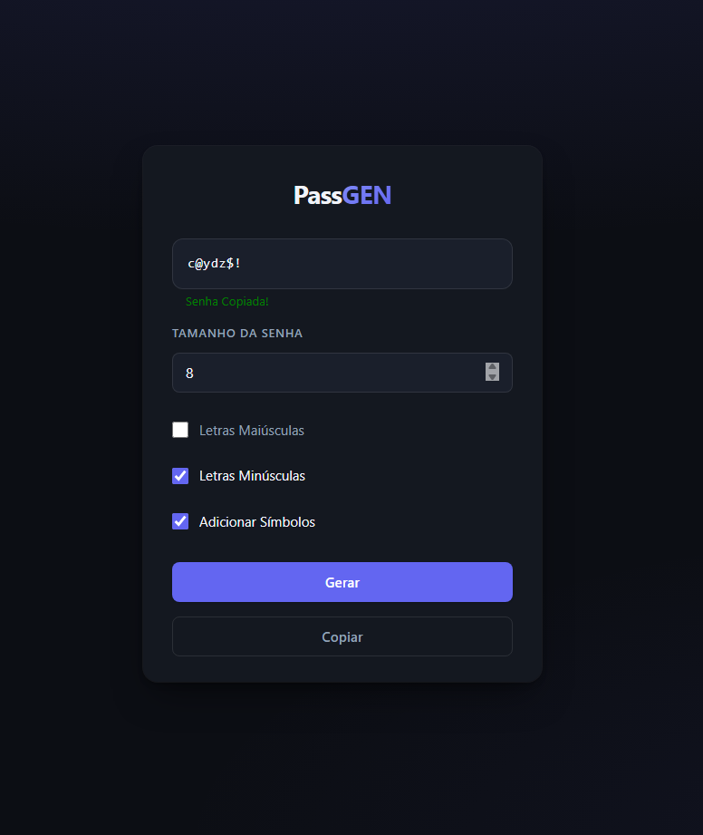
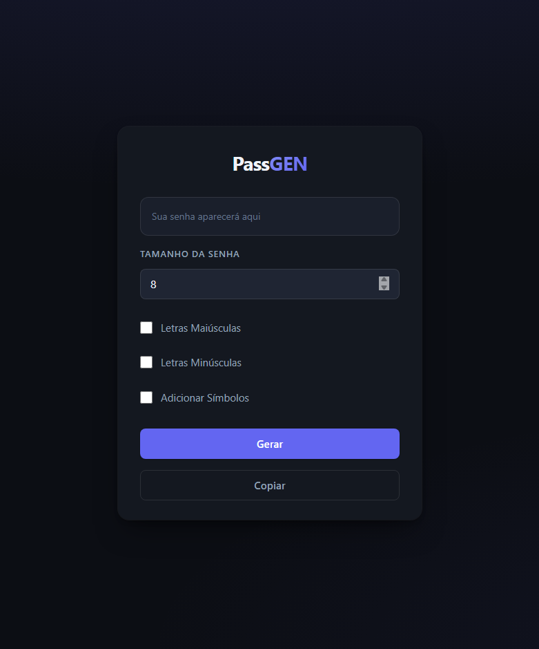

PassGEN 🔐

Gerador de senhas aleatórias desenvolvido com HTML, CSS e JavaScript puro.
O projeto permite criar senhas personalizadas com letras maiúsculas, minúsculas, números e símbolos, além de copiar a senha diretamente para a área de transferência.

🚀 Funcionalidades
    Gerar senhas aleatórias
    Escolher o tamanho da senha
    Incluir:
    Letras maiúsculas
    Letras minúsculas
    Números
    Símbolos
    Copiar senha com 1 clique
    Feedback visual ao copiar senha

🛠 Tecnologias utilizadas
    HTML5
    CSS3
    JavaScript (Vanilla JS)

🧠 Lógica utilizada

  querySelector para manipulação do DOM
  Eventos com addEventListener
  Arrays e flat()
  Geração aleatória com:
  Math.floor(Math.random() * chars.length)
  Clipboard API:
  navigator.clipboard.writeText()

📌 Melhorias futuras
  Indicador de força da senha
  Responsividade mobile aprimorada
  Histórico de senhas geradas
  Tema dark/light
  Opção para evitar caracteres repetidos
    
📸 Preview

